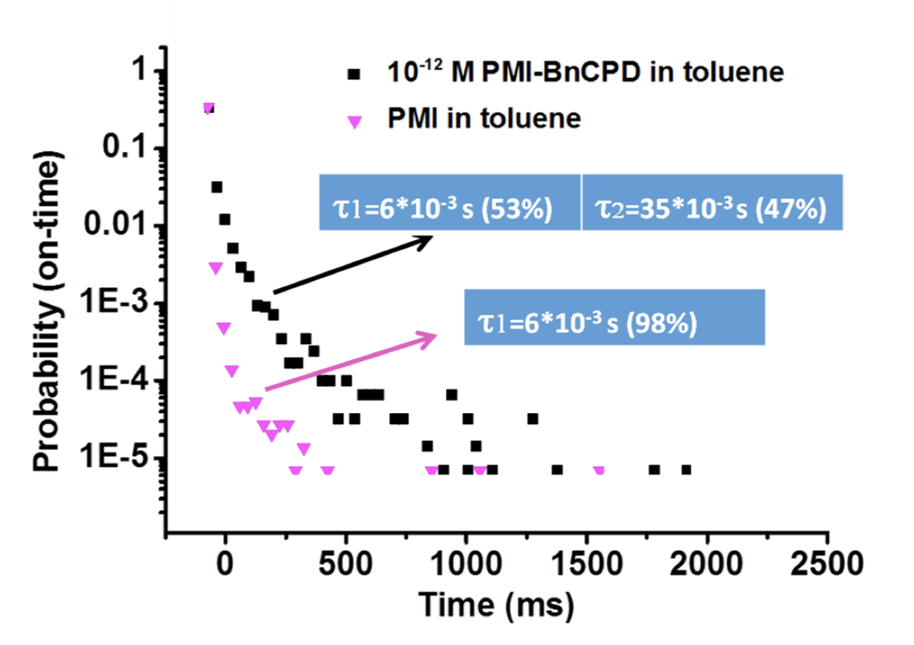

# Tracking Particle Matlab
## Image processing with band-pass filter
Band filter is applied to reduce the noise of images. Band filter is applied to reduce noise of images. Low frequency is used to remove high frequency noise such as salt-and-pepper noise. Low pass filter boxcar convolution and gaussian convolution are employed to build band-pass filter to remove noise.

## Data modeling of poisson process
This is collections of codes employed to recognize particles. The filter and particle localization part is from another group. The binding time of two molecules in this stochastic porcess is exponentail distribution. Data analysis and data modeling of the molecules' seperation process are performed to get the efftive binding time of molecules. The efftive binding time for two different catalysts are shown as below.
<!--{ width=50% height=50% }-->

